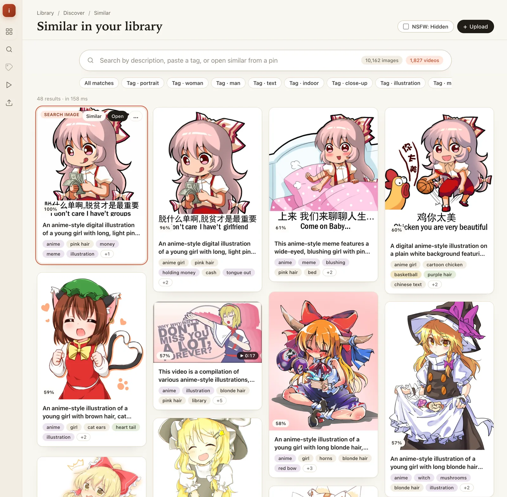

# imgsearch

`imgsearch` is a local-first image organization and similarity search app.

It runs as a small local web app that:
- indexes images into a SQLite-backed library,
- supports text-to-image and image-to-image search,
- keeps data on your machine,
- uses a built-in default multimodal embedding setup.

## Screenshot



## Quick Start

### Use the Release

1. Download the latest archive from the GitHub `rolling` release for your system.
2. Extract it.
3. Install `libvips` on your machine.
4. Run `./imgsearch`.
5. Open `http://127.0.0.1:8080/`.

On first run, `imgsearch` downloads the default 2B embedding model into `./models/VesNFF/Qwen3-VL-Embedding-2B-GGUF/` if it is missing, and also downloads the default Gemma `e4b` annotator files when annotations are enabled.

### Import Images

With the app running, import a folder recursively:

```bash
./scripts/import_images.sh ~/Pictures/memes
```

Or any other folder:

```bash
./scripts/import_images.sh /path/to/your/images
```

The import script uploads supported images to the local app and indexing continues in the background.

You can also import full-size pictures and webms from a 4chan thread URL:

```bash
./scripts/import_images.sh https://boards.4chan.org/v/thread/737156945
```

For 4chan thread imports, the script pulls full files from `i.4cdn.org` (not thumbnails) and currently imports supported thread pictures plus `.webm` files.
If 4chan rate-limits requests (`HTTP 429`), the importer retries with `Retry-After` support.
If needed, tune retry behavior with `IMGSEARCH_IMPORT_HTTP_MAX_ATTEMPTS` and `IMGSEARCH_IMPORT_HTTP_RETRY_DELAY_SECONDS`.
By default, 4chan media downloads are paced (about every 5 seconds with jitter) to reduce rate-limit spikes.
`scripts/import_images.sh` / `mise run import-images` now sends an API key header by default.
Set `IMGSEARCH_IMPORT_API_KEY` (or `IMGSEARCH_API_KEY`) to override the built-in development key.

### Build From Source

If there is no release for your system:

1. Install Go, CMake, and `libvips`.
2. Initialize the llama.cpp submodule:
   - `git submodule update --init --recursive deps/llama.cpp`
3. Build llama.cpp runtime libraries:
   - `./scripts/ensure_llama_cpp_native_build.sh`
4. Install sqlite-vector:
   - `./scripts/setup_sqlite_vector.sh`
5. Run the app:
   - `go run ./cmd/imgsearch`

Cross-platform note:
- Keep host-native llama.cpp artifacts in `./deps/llama.cpp/build` only.
- If you build Linux artifacts from Docker on macOS, write them to an explicit separate directory such as `./build-artifacts/llama.cpp/linux-cuda13/` and pass `IMGSEARCH_LLAMA_LIB_DIR=/absolute/path/to/.../bin` when packaging.

### Podman + CUDA (Ubuntu Container)

If you want to run on a CUDA host through Podman while keeping an Ubuntu userspace, use `Containerfile.cuda`.

Quick path (host-accessible):

```bash
podman build -f Containerfile.cuda -t imgsearch:cuda .
podman run -d --name imgsearch --replace --gpus=all -p 8080:8080 \
  -e IMGSEARCH_ADDR=0.0.0.0:8080 \
  -e IMGSEARCH_API_KEY='replace-with-a-strong-token' \
  -v "$HOME/imgsearch-data:/data" \
  -v "$HOME/imgsearch-models:/models" \
  imgsearch:cuda
```

The container defaults to loopback-only bind (`127.0.0.1:8080`) for safer startup.
Set `IMGSEARCH_ADDR=0.0.0.0:8080` only when you intentionally want remote access, keep `IMGSEARCH_API_KEY` set, and place the service behind a trusted reverse proxy/TLS boundary.

Full instructions are in `docs/podman-cuda-ubuntu.md`.

## Models And Downloads

Model choice matters more than most runtime knobs. If you are memory constrained, stay on the default smaller search model and disable annotations before tuning GPU layers or batch size.

Search embedding models:

| Model | Dimensions | Best For | Download |
| --- | ---: | --- | --- |
| Qwen3-VL-Embedding-2B-Q6_K | 2048 | Default profile for CPU-only, low-VRAM, and modest unified-memory systems | Auto-downloaded at default paths |
| Qwen3-VL-Embedding-8B-Q4_K_M | 4096 | Higher-quality search profile for good GPUs and high-memory unified-memory systems | Auto-downloaded when the 8B paths below are selected |

Annotation models:

| Model | Variant | Best For | Download |
| --- | --- | --- | --- |
| Gemma-4-E4B-Uncensored-HauhauCS-Aggressive-Q4_K_P | `e4b` | Default descriptions/tags with lower memory than 26B | Auto-downloaded when annotations are enabled |
| gemma-4-26b-a4b-it-heretic.q4_k_m | `26b` | Richer descriptions/tags on high-memory systems | Auto-downloaded with `-llama-native-annotator-variant 26b` |

Vision models require two files: the base `.gguf` and the matching `mmproj-*.gguf`. Do not mix 2B and 8B model files, and keep `-llama-native-dimensions` matched to the embedding model (`4096` for 8B, `2048` for 2B).

Default 2B search files are downloaded automatically when these paths are missing:

```text
./models/VesNFF/Qwen3-VL-Embedding-2B-GGUF/Qwen3-VL-Embedding-2B-Q6_K.gguf
./models/VesNFF/Qwen3-VL-Embedding-2B-GGUF/mmproj-Qwen3-VL-Embedding-2B-f16.gguf
```

Manual pre-download for the default 2B search model:

```bash
mkdir -p ./models/VesNFF/Qwen3-VL-Embedding-2B-GGUF
curl -L -o ./models/VesNFF/Qwen3-VL-Embedding-2B-GGUF/Qwen3-VL-Embedding-2B-Q6_K.gguf \
  https://huggingface.co/VesNFF/Qwen3-VL-Embedding-2B-GGUF/resolve/main/Qwen3-VL-Embedding-2B-Q6_K.gguf
curl -L -o ./models/VesNFF/Qwen3-VL-Embedding-2B-GGUF/mmproj-Qwen3-VL-Embedding-2B-f16.gguf \
  https://huggingface.co/VesNFF/Qwen3-VL-Embedding-2B-GGUF/resolve/main/mmproj-Qwen3-VL-Embedding-2B-f16.gguf
```

The larger 8B search model is also auto-downloaded when you run with the 8B model path and `-llama-native-dimensions 4096`. Optional manual pre-download:

```bash
mkdir -p ./models/Qwen
curl -L -o ./models/Qwen/Qwen3-VL-Embedding-8B-Q4_K_M.gguf \
  https://huggingface.co/lainsoykaf/Qwen3-VL-Embedding-8B-GGUF/resolve/main/Qwen3-VL-Embedding-8B-Q4_K_M.gguf
curl -L -o ./models/Qwen/mmproj-Qwen3-VL-Embedding-8B-f16.gguf \
  https://huggingface.co/lainsoykaf/Qwen3-VL-Embedding-8B-GGUF/resolve/main/mmproj-Qwen3-VL-Embedding-8B-f16.gguf
```

The default `e4b` and optional `26b` annotators are also downloaded automatically when their default paths are used. Skip annotation downloads and model loading with:

```bash
./imgsearch -enable-annotations=false
```

Manual pre-download for the default `e4b` annotator:

```bash
mkdir -p ./models/HauhauCS/Gemma-4-E4B-Uncensored-HauhauCS-Aggressive
curl -L -o ./models/HauhauCS/Gemma-4-E4B-Uncensored-HauhauCS-Aggressive/Gemma-4-E4B-Uncensored-HauhauCS-Aggressive-Q4_K_P.gguf \
  https://huggingface.co/HauhauCS/Gemma-4-E4B-Uncensored-HauhauCS-Aggressive/resolve/main/Gemma-4-E4B-Uncensored-HauhauCS-Aggressive-Q4_K_P.gguf
curl -L -o ./models/HauhauCS/Gemma-4-E4B-Uncensored-HauhauCS-Aggressive/mmproj-Gemma-4-E4B-Uncensored-HauhauCS-Aggressive-f16.gguf \
  https://huggingface.co/HauhauCS/Gemma-4-E4B-Uncensored-HauhauCS-Aggressive/resolve/main/mmproj-Gemma-4-E4B-Uncensored-HauhauCS-Aggressive-f16.gguf
```

Manual pre-download for the `26b` annotator:

```bash
mkdir -p ./models/nohurry/gemma-4-26B-A4B-it-heretic-GUFF
curl -L -o ./models/nohurry/gemma-4-26B-A4B-it-heretic-GUFF/gemma-4-26b-a4b-it-heretic.q4_k_m.gguf \
  https://huggingface.co/nohurry/gemma-4-26B-A4B-it-heretic-GUFF/resolve/main/gemma-4-26b-a4b-it-heretic.q4_k_m.gguf
curl -L -o ./models/nohurry/gemma-4-26B-A4B-it-heretic-GUFF/gemma-4-26B-A4B-it-heretic-mmproj.f16.gguf \
  https://huggingface.co/nohurry/gemma-4-26B-A4B-it-heretic-GUFF/resolve/main/gemma-4-26B-A4B-it-heretic-mmproj.f16.gguf
```

If automatic downloads fail, use the direct URLs in `cmd/imgsearch/default_model_assets.go` to pre-stage the files under `./models/`.

### Switching Models Reindexes Your Library

`imgsearch` versions the embedding configuration. Changing the search model path, mmproj path, embedding dimensions, image size, image token cap, or retrieval instructions creates a new model version.

On startup after a model/config change, the app removes old embeddings and queues the library for re-embedding. Images and videos stay in the library, but search results are incomplete until the worker catches up. For large libraries, change model settings during idle time or back up `./data` first.

## System Recommendations

### Good GPU Or Unified Memory

Use the 8B search model plus the default `e4b` annotator:

```bash
./imgsearch \
  -llama-native-model-path ./models/Qwen/Qwen3-VL-Embedding-8B-Q4_K_M.gguf \
  -llama-native-mmproj-path ./models/Qwen/mmproj-Qwen3-VL-Embedding-8B-f16.gguf \
  -llama-native-dimensions 4096
```

From a source checkout, the matching developer command is:

```bash
mise run "serve:8b"
```

This trades higher memory use for better search quality while keeping image/video search, background indexing, and generated descriptions/tags.

### CPU-Only Or Low VRAM

The default search model is already 2B. Disable annotations first if memory is tight; it is usually the biggest remaining memory reduction.

```bash
./imgsearch -enable-annotations=false
```

For CPU-only, add:

```bash
-llama-native-use-gpu=false -llama-native-gpu-layers 0
```

If a low-VRAM GPU still runs out of memory with the 2B model, add smaller runtime knobs:

```bash
-llama-native-gpu-layers 20 -llama-native-batch-size 128 -llama-native-image-max-side 320
```

For `mise run serve`, no 2B embedder override is needed. To skip annotations from a source checkout, run the binary directly:

```bash
go run ./cmd/imgsearch -enable-annotations=false
```

Use direct `./imgsearch` or `go run ./cmd/imgsearch` when you need flags that are not wired into a `mise` task.

### Search-Only Server

Use this when you mainly care about similarity/text search and want to avoid loading any annotation model:

```bash
./imgsearch -enable-annotations=false
```

This still embeds images and videos for search. It skips generated descriptions/tags, which is usually the largest memory and latency reduction after choosing the smaller search model.

### Large GPU And Better Annotations

On larger GPUs or high-memory unified-memory systems, you can try the 26B annotator for richer descriptions:

```bash
./imgsearch -llama-native-annotator-variant 26b
```

From a source checkout:

```bash
mise run "serve:8b:annotator-26b"
```

This is the heaviest local profile. If interactive search latency matters, run the UI/API without annotations and run a worker separately when you want to backfill annotations:

```bash
./imgsearch -mode=api -enable-annotations=false
./imgsearch -mode=worker -llama-native-annotator-variant 26b
```

Both processes must point at the same `-data-dir` if you split them. On a single GPU, split mode can still increase total memory if API and worker run at the same time; if memory is tight, run the worker as a batch backfill job and stop it before latency-sensitive searches.

### Quick Tuning Reference

| Symptom | First change to try |
| --- | --- |
| GPU out of memory on startup | Use the 2B search model, which is the default, or add `-enable-annotations=false` |
| GPU out of memory while embedding | Lower `-llama-native-gpu-layers`, then lower `-llama-native-batch-size` |
| System memory pressure on CPU | Use the 2B model, disable annotations, and lower `-llama-native-image-max-side` |
| Indexing is too slow but stable | Raise `-llama-native-gpu-layers` or `-llama-native-batch-size` one step at a time |
| Descriptions/tags are not needed | Keep `-enable-annotations=false` permanently |

## Notes

- The app binds to `127.0.0.1:8080` by default.
- Supported formats: JPEG, PNG, WEBP, and AVIF.
- Embedding uses the in-process `llama-cpp-native` runtime with the Qwen3-VL-Embedding-2B GGUF pair by default.
- The default Qwen 2B embedding files and the default Gemma `e4b` annotator files are downloaded automatically on first run when missing.
- Add `-enable-annotations=false` if you want to run the API without loading the Gemma annotation model.
- Add `-mode=api` or `-mode=worker` if you want to split the HTTP server and background worker into separate processes.
- `/api/*` routes are authenticated by default.
- Set `-api-key <token>` (or `IMGSEARCH_API_KEY`) to use your own key; when unset, the server falls back to a built-in development key and logs a startup warning.
- If you bind to a non-loopback address (for example `-addr 0.0.0.0:8080`), startup requires an explicit strong API key; the built-in development key is rejected.
- API clients can authenticate with `X-Imgsearch-API-Key: <token>` or `Authorization: Bearer <token>`.
- Multipart uploads to `/api/upload` keep partial-success semantics: each uploaded file returns either IDs/digest data or an `error`, mixed success/failure batches return `207 Multi-Status`, and oversized requests return `413 Payload Too Large`.
- Data is stored in `./data` by default.
- The UI includes uploads, indexing status, gallery browsing, text search, and similar-image search.

## For Developers

Development-focused setup, tasks, integration checks, and lower-level runtime notes are in:

- `docs/development.md`
- `docs/architecture.md`
- `docs/mvp-plan.md`
- `docs/decisions.md`
